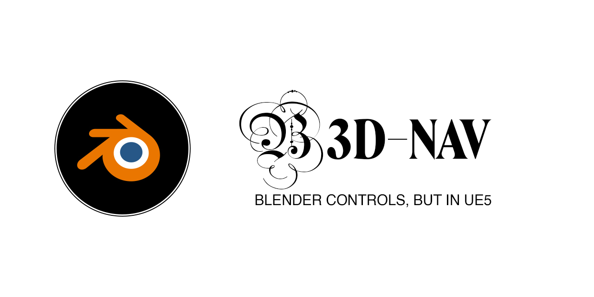

# B3D Nav
B3D-Nav is a utility plugin for Unreal Engine that brings Blender-like object manipulation controls directly into your Unreal Engine projects. Inspired by Blender's intuitive and efficient workflow, this plugin provides a modal mode interface for moving, rotating, and scaling objects with ease.

## Features:
- Modal Mode Interface: Enter a modal mode with a single key press to perform object manipulation tasks.
- Screen Space Manipulation: Move, rotate, and scale objects directly in screen space for precise control.
- Axis Locking: Lock movement, rotation, or scaling to specific axes for fine-tuned adjustments.
- Numeric Input: Input numeric values to specify precise transformations, such as distance, angle, or scaling factor.
- Intuitive Controls: Mimics the familiar controls and workflow of Blender, making it easy for Blender users to transition to Unreal Engine.

## Installation
1. Open your Unreal Engine project.
2. Go to "Edit" -> "Plugins" in the main menu.
3. Under the "Installed" section, find your plugin (it may appear under the "Project" category).
4. Check the checkbox next to your plugin to enable it.
5. If prompted, restart the Unreal Editor to apply changes.